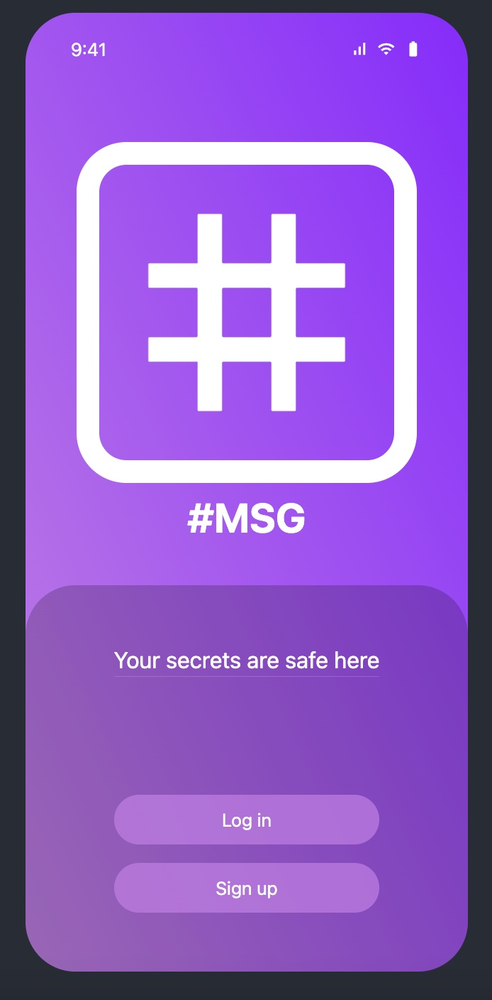
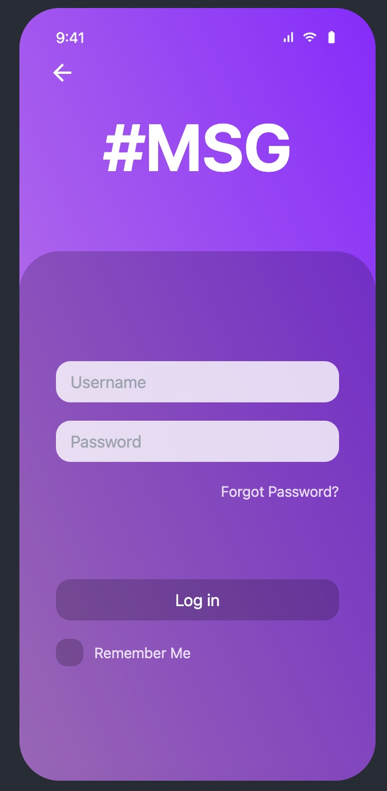
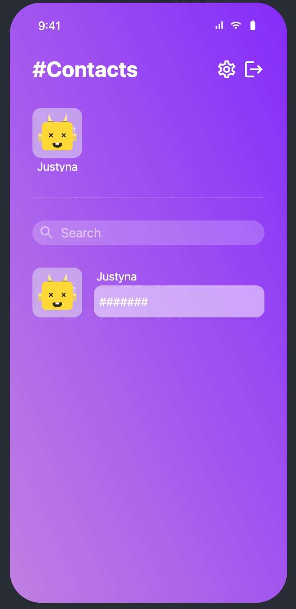
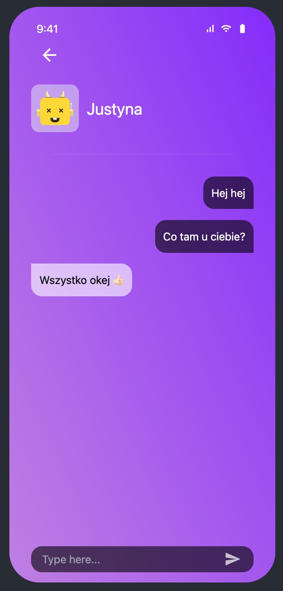

# #MSG :busts_in_silhouette: :speech_balloon:
Repozytorium zawiera aplikację do czatowania, która została stworzona w technologii blockchain.   
Stworzone w celu zaliczenia przedmiotu.   
***
Aplikacja posiada takie funkcjonalności jak:
* logowanie i rejestracje użytkownika
* przechowywanie listy kontaktów
* operacje dodawania i usuwania kontaktu   
# Informacje dodatkowe

__Narzędzia:__
* MongoDB
* Aleph.im
* VSC
* GitHub

__Środowisko:__  
* React.js
* Node.js
***

# Ekrany aplikacji

